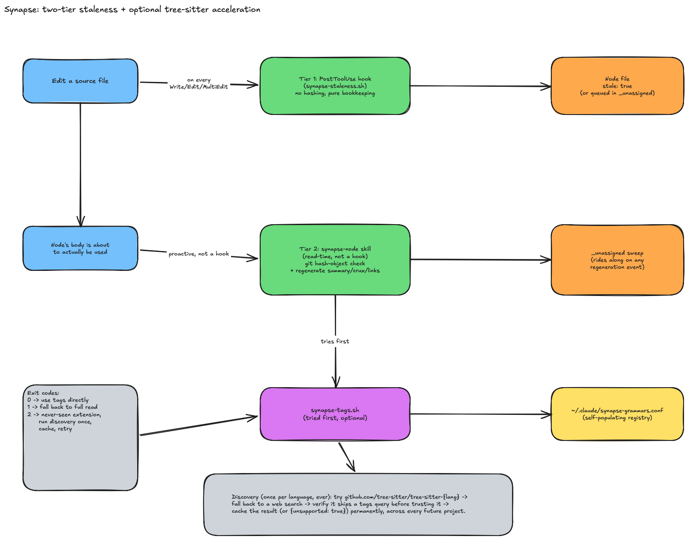

# Synapse: the per-repo code graph

Claude Code re-explores a codebase from scratch every session — grep a term, open a file, follow
an import, back out, try again — and whatever it learns dies with the session. Synapse is a small,
LLM-authored map of a repo's subsystems (summary + crux + typed links per concept), hosted in the
second brain vault instead of a repo-local folder, so it's global across every project and
searchable the same way any other note is. It's inspired by
[NanoNets/Graft](https://github.com/NanoNets/Graft) but deliberately much smaller in scope — single
consumer (Claude Code only), no multi-agent wiring, no standing CLI surface.

## Dormant until opted in

A project has no Synapse namespace at all until `/synapse-init` is run inside it, deliberately.
Every other Synapse mechanism's cost is gated behind that namespace existing — the `SessionStart`
hook's check is a plain path lookup, never a model call, so a project that never opts in pays
nothing, forever.

## `/synapse-init`: first build

Walks the repo's tracked files (`git ls-files`, so `.gitignore` exclusion is free), runs a
per-file-summary-then-clustering pass biased by `CLAUDE.md`/`README.md` if present (hints, never
authoritative structure), and writes:

- One node file per subsystem/concept — a few dozen per repo, not one per file — under
  `synapse/{repo-name}/{Node Title}.md`. Each carries `sources` (repo-relative paths + a
  `git hash-object` fingerprint per file), a plain-English `summary`, a `crux` (the few lines that
  carry the actual logic, stored as quoted text so it survives line drift, not line numbers),
  typed `links` to other nodes, and a `## Notes` section preserved verbatim across every future
  regeneration.
- `_index.json` — a derived, machine-only reverse index (source path → owning node filenames, plus
  an `_unassigned` bucket for anything not yet claimed) that the cheap staleness hook can look up
  directly, without reasoning about anything.
- `synapse/{repo-name}/Index.md` — the human/Claude-facing map: node titles, one-line summaries,
  and a `remote` field (the repo's git remote, or its absolute path if it has none) used to detect
  a rare same-basename collision between two unrelated repos.

Re-running it on an already-initialized project doesn't rebuild anything — it's just the manual
fallback for sweeping the `_unassigned` bucket, for a repo that's gone fully dormant with no other
regeneration event to piggyback the sweep onto.

## Two-tier staleness

**Tier 1 — `PostToolUse` → `synapse-staleness.sh`.** Fires on every `Write`/`Edit`/`MultiEdit`.
Resolves the repo root and looks the edited path up in that repo's `_index.json`: if it belongs to
one or more nodes, PATCHes each one's `stale` frontmatter field to `true`; if it's not in the index
at all, appends it to `_unassigned` instead. No hashing here — the hook already knows with
certainty which file just changed, so this tier is pure bookkeeping, not verification.

**Tier 2 — read-time, the `synapse-node` skill.** Not a hook — a procedure Claude follows itself,
proactively, whenever a node's body is about to actually be used (not a title-only skim). If
`stale` is already `true`, skip straight to regeneration. Otherwise, run `git hash-object` on each
of the node's `sources` and compare to the stored hash — a single mismatch (including the file
having been renamed or deleted) counts the same as `stale: true`. This is the tier that catches
everything Tier 1 can't see by construction: edits made outside a Claude Code session, `git pull`,
branch switches.

Regeneration re-reads the node's current sources, rewrites `summary`/`crux`/`links` (never
`## Notes`), recomputes hashes, and is always announced out loud — it has real latency/token cost,
unlike the cheap detection step, so it's never absorbed silently into a read. The same event
unconditionally sweeps the whole `_unassigned` bucket too, not just entries related to whatever
triggered the regeneration — classifying each file against the existing node list and attaching or
leaving it unassigned, announcing either outcome.

## Optional tree-sitter acceleration

`claude/bin/synapse-tags.sh` is a narrow, purely mechanical helper both `/synapse-init` and the
`synapse-node` skill try before doing a full read: given a file, it prints `tree-sitter tags`
output — real definitions and name-based call references, extracted by parsing, not text
guessing — cutting straight to clustering/regeneration signal without reading the file's full body.

It's optional at every layer, never a hard dependency:

- **Grammar registry** (`~/.claude/synapse-grammars.conf`) is self-populating, not hand-curated.
  The first time a never-seen file extension shows up, Claude runs a one-time discovery procedure
  (try `github.com/tree-sitter/tree-sitter-{lang}`, fall back to a web search, verify the repo
  actually ships a tags query before trusting it) and caches the result — positive or
  `{"unsupported": true}` — permanently, across every future project, not just the one that
  triggered it.
- **Exit codes are the whole contract**: `0` → tags printed, use them; `1` → not usable right now
  (missing `tree-sitter`, no C compiler, a confirmed-unsupported language) — fall back to reading
  the file directly, silently; `2` → never-seen extension, run discovery once, then retry.
- Grammars build as native libraries (`tree-sitter build`, no `--wasm` — WASM was tried and
  rejected: the CLI needs a non-default Rust build to *consume* WASM grammars, which is a worse
  dependency than the C compiler needed to build native ones).

Every one of these fallback paths was verified directly, not assumed — including catching and
fixing a real bug where a qualified-path reference (`Eon_ecs.Foo.bar`) got double-counted as a bare
same-package reference, producing edges that didn't actually exist in the code.
